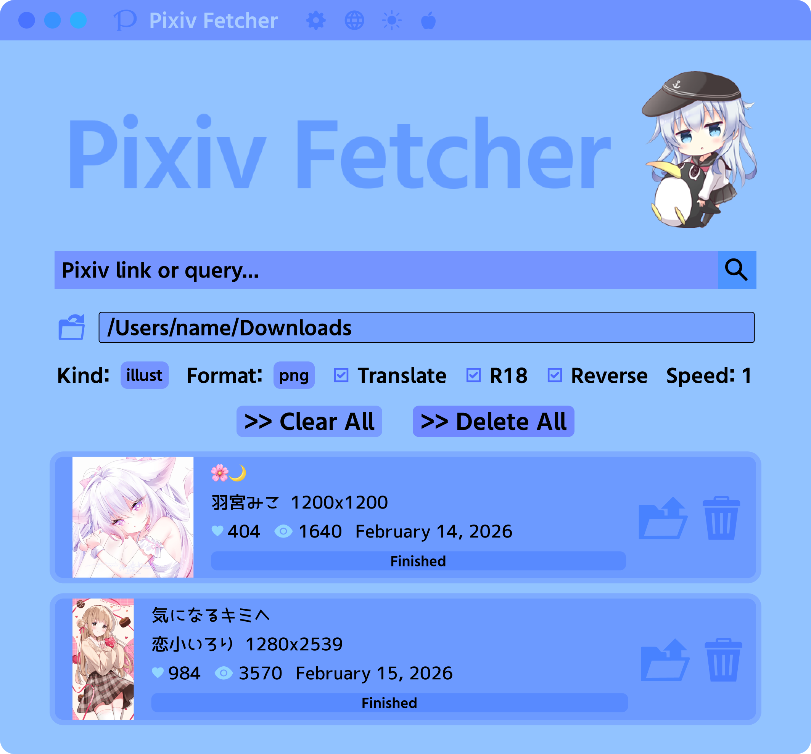

## Pixiv Fetcher



This app lets you download images & ugoira from Pixiv.

### Features
- Download illustrations, manga (png/jpg), novels (txt), and ugoiras (gif/zip)
- Bulk download illustrations by tag
- Download all of an artist's illustrations
- Download all of an artist's bookmarks
- Option to automatically translate tags to Japanese and translate titles to English
- Customize the output file names
- Map illustrations to sub-folders based on certain tags
- If you have Pixiv Premium, you can sort results by popularity

### Output Template

You can customize the output file names. The default is `{id}*_p{page}*`. Adding slashes will create subfolders,
e.g. `{artist}/{title}`. Any asterisks will be removed, as they are a special option for page numbers. The following replacements are available:

{title} - The title of the illustration. It will be translated if "translate titles" is enabled. \
{id} - The id of the illustration. \
\*{page}\* - The page number. The asterisk indicates that this will be omitted if there is only a single page. \
{artist} - The artist of the illustration. \
{user} - The pixiv id of the artist. \
{user id} - The user id of the artist. \
{date} - The date in YYYY-MM-DD format. \
{width} - The width of the illustration. \
{height} - The height of the illustration.

### Folder Mapping

An advanced option is to map images with certain tags into a subfolder. The folder mapping must be
in the format `folderName:tagName, folderName2:tagName2, folderName3:tagName3...`. Note that the list should
be comma separated. 

For example, if you search for "gabriel dropout" but want to map the different characters into sub-folders,
you should provide the folder mapping:

`gabriel:天真=ガヴリール=ホワイト, satania:胡桃沢=サタニキア=マクドウェル, raphi:白羽=ラフィエル=エインズワース, vigne:月乃瀬=ヴィネット=エイプリル`. 

For better accuracy provide the tags in Japanese, but they will be automatically translated if you have the translate option enabled. Note that these characters have special translations so the following will also work:

`gabriel:gabriel, satania:satania, raphi:raphi, vigne:vigne`

### Design

Our design is available here: https://www.figma.com/design/utGtwyDdkigOGlfYjFYQiD/Pixiv-Fetcher

*New design is wip

### Installation

Download from [releases](https://github.com/Moebytes/Pixiv-Fetcher/releases).

### MacOS

On MacOS unsigned applications won't open, run this to remove the quarantine flag.
```
xattr -d com.apple.quarantine "/Applications/Pixiv Fetcher.app"
```

